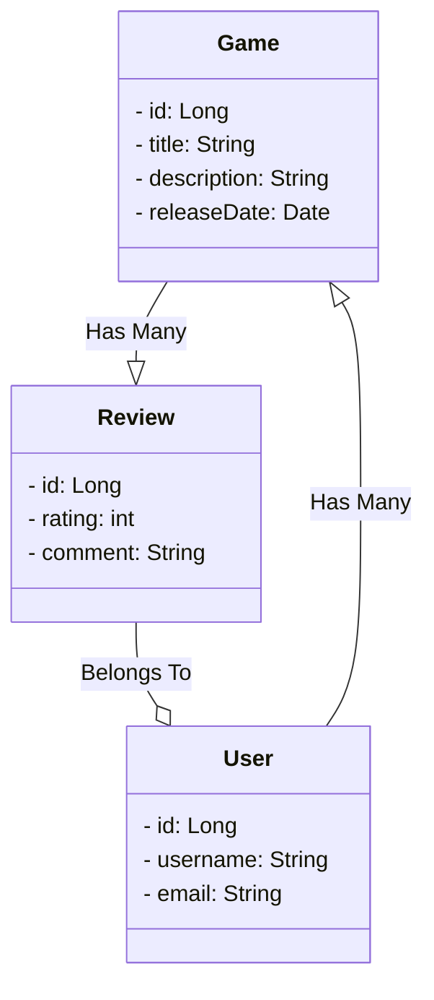

# Avaliador de Games

## Projeto desenvolvido no último módulo do Bootcamp Angular + Spring na DIO.me

## Descrição
Este é um projeto de API RESTful desenvolvido em Spring Boot para gerenciar avaliações de jogos. A API permite que os usuários criem jogos, façam avaliações e recuperem informações sobre jogos e avaliações. 

## Diagrama de classes

## Funcionalidades
- Cadastro de jogos
- Cadastro de avaliações
- Recuperação de avaliações de jogos
- Recuperação de informações de jogos
- Cálculo da média das avaliações de um jogo

## Endpoints

### Games
- **GET** `/games`: Retorna a lista de jogos disponíveis.
- **POST** `/games`: Cria um novo jogo.
- **GET** `/games/{id}`: Retorna detalhes de um jogo específico por ID.
- **GET** `/games/{id}/reviews`: Retorna as avaliações de um jogo específico.

### Reviews
- **GET** `/reviews`: Retorna a lista de todas as avaliações.
- **POST** `/reviews`: Cria uma nova avaliação.
- **GET** `/reviews/{id}`: Retorna detalhes de uma avaliação específica por ID.

### Users
- **GET** `/users`: Retorna a lista de usuários cadastrados.
- **POST** `/users`: Cria um novo usuário.
- **GET** `/users/{id}`: Retorna detalhes de um usuário específico por ID.

## Requisitos
- Java 11
- Spring Boot 2.7
